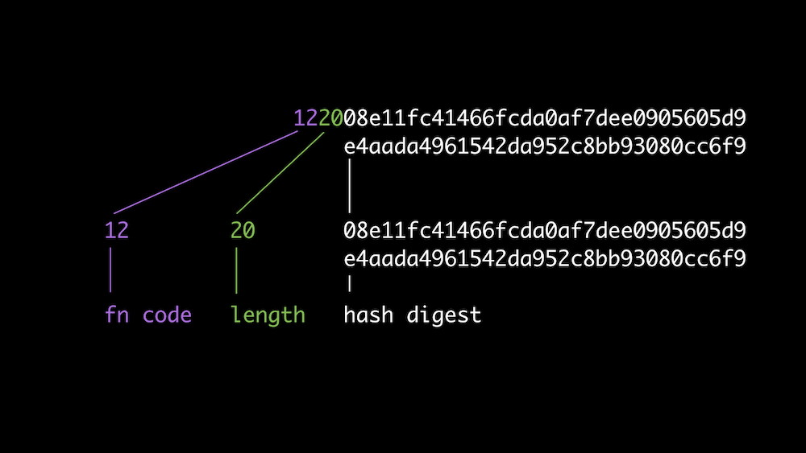

# IPFS CID Storage Analysis

This code was forked from [here](https://github.com/gjeanmart/stackexchange/tree/master/61100-how-much-does-it-cost-to-store-each-ipfs-hash-in-ethereum-blockchain). An additional and more efficient method was added.

In this analysis the different methods of storing an IPFS CID on the Ethereum blockchain is investigated and the network fees (gas cost) are analysed.

The analogy of an IPFS CID multihash is defined as follows:



The fn code defines which hash-function is used. The complete table for all fn code can be found [here](https://ipfs.io/ipfs/QmXec1jjwzxWJoNbxQF5KffL8q6hFXm9QwUGaa3wKGk6dT/#title=Multicodecs&src=https://raw.githubusercontent.com/multiformats/multicodec/master/table.csv).

## Findings

The goal of each method is to store an IPFS multihash on the Ethereum blockchain. For this analysis, the following CID is used:

```js
const cid = "QmWATWQ7fVPP2EFGu71UkfnqhYXDYH566qy47CnJDgvs8u";
```

Furthermore, it is asumed that one unit of gas costs:

```
gasPrice: 20000000000
```

**Stroing CID as String**

```solidity
string hash;
function storeCIDAsString(string memory _hash) public {
    hash = _hash;
}
```

```
gasUsed: 86163 units
gasCost (ether): 0.00172326 ether
```

**Stroing CID as Struct**

```solidity
struct Multihash {
    bytes2 hash_function;
    uint8 size;
    bytes32 hash;
}

Multihash multihash;

function storeCIDAsStruct(bytes2 _hash_function, uint8 _size, bytes32 _hash) public{
    multihash = Multihash(_hash_function, _size, _hash);
}
```

```
gasUsed: 69848 units
gasCost (ether): 0.00139696 ether
```

**Stroing CID as String in logs**

```solidity
    event CIDStoredInTheLog(string _hash);

    function storeCIDInTheLog(string memory _hash) public {
        emit CIDStoredInTheLog(_hash);
    }
```

```
gasUsed: 27675 units
gasCost (ether): 0.0005535 ether
```

**Stroing CID as String in logs**

```solidity
    event CIDStoredInTheLog(string _hash);

    function storeCIDInTheLog(string memory _hash) public {
        emit CIDStoredInTheLog(_hash);
    }
```

```
gasUsed: 25841 units
gasCost (ether): 0.00051682 ether
```

### Conclusion

As shown in these examples, the gas prices can be greatly reduced when storing an IPFS CID in the logs with data types of distinct length.

```
25841 / 86163 < 0.3
```

So in average more than 70% of gas can be saved.

## Installation

### Prerequisites

- [Git](https://git-scm.com/) command line interface
- [Node.js](https://nodejs.org/) command line interface
- [Ganache](https://www.trufflesuite.com/ganache) to spin up a blockchain with funded test accounts and instant mining

### Setup

Clone the repo:

```bash
git clone https://github.com/bc-ticketing/ipfs-multihash-analysis
cd ipfs-multihash-analysis
```

Install Truffle

```bash
sudo npm install -g truffle
```

Run the tests

```bash
npm install
npm test
```
